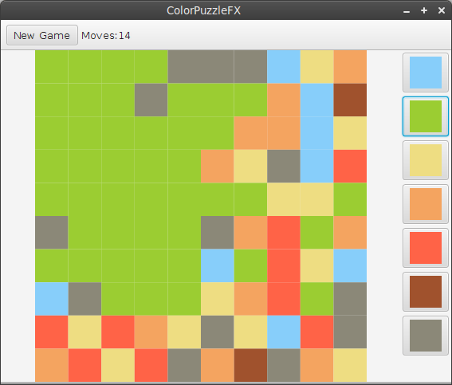

# ColorPuzzleFX

This is a little Game written with JavaFX (8).
It's a remake of a [game](https://github.com/lestard/ColorPuzzle) I have developed some time ago with Java Swing.

### Play the game

You can download a runnable JAR from the [release-secton](https://github.com/lestard/ColorPuzzleFX/releases/download/v0.1.0/colorpuzzlefx.jar) of github. To run the game you need Oracles Java version 8 installed.

### Build the game

To build the game you need the build system [gradle](http://www.gradle.org/) to be installed.
You can then run `./gradlew run` (linux/mac-os) or `gradlew.bat run` (windows) on the command line to execute the application.

A runnable JAR can be created with `./gradlew shadowJar`. The JAR file is then located under `build/libs/colorpuzzlefx-all.jar`. 
